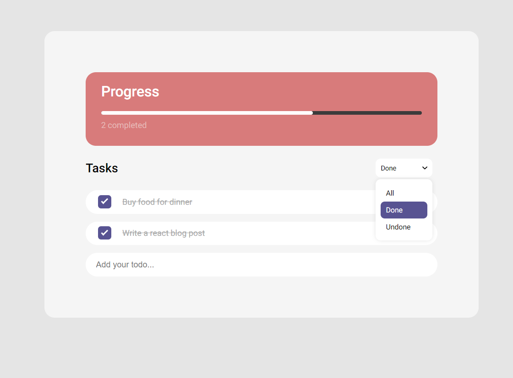

# Todo List

### Producted by React+Hook / Redux / Json-server API / Scss

#### -  Function of web application

-   Add Todo
-   Delete Todo
-   Edit Todo
-   have 3 type of filter (All / Done / Undone)
-   Progressbar ( Have a percentage and tasks completed)
-   Can checking task, when checked todo it will apprear on tasks completed as a number and progressbar as percentage

#### -  Have 4 size of Responsive ( 576px / 768px / 992px / 1200px )

________________________________

### Running web application follow this progress

1.  type **__npm install__**  for installing package
2.  open terminal and type **__npm start__** 
3.  open second terminal and type **__npm run json-server__**  it will simulation server as local 

